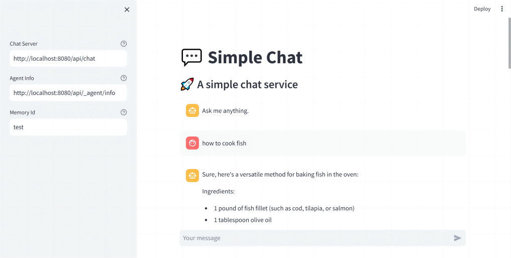
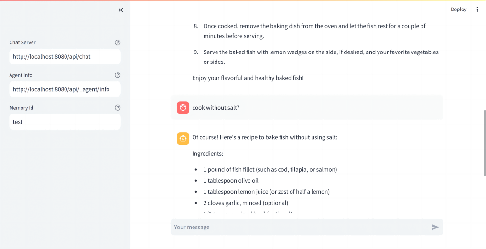

# LLM Agent Builder Example - Simple Chat

A simple chat service with message history enabled.

## Quick Start

Start the Spring Boot application, and run `streamlit run ChatAgentUI.py`
in `chat-agent-ui` directory.

## Screenshots

